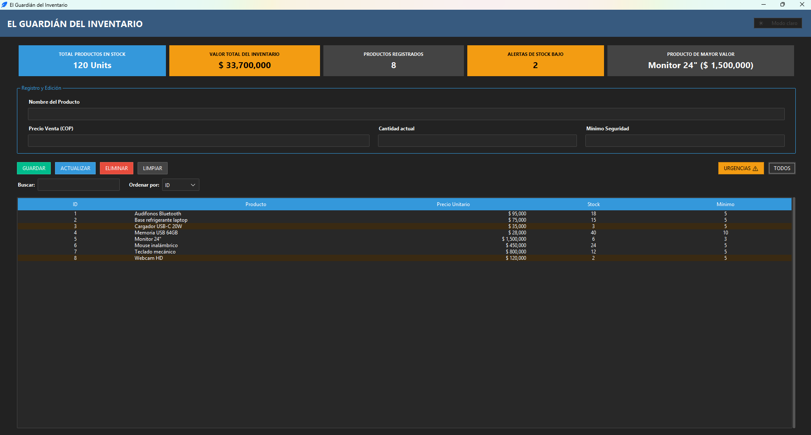
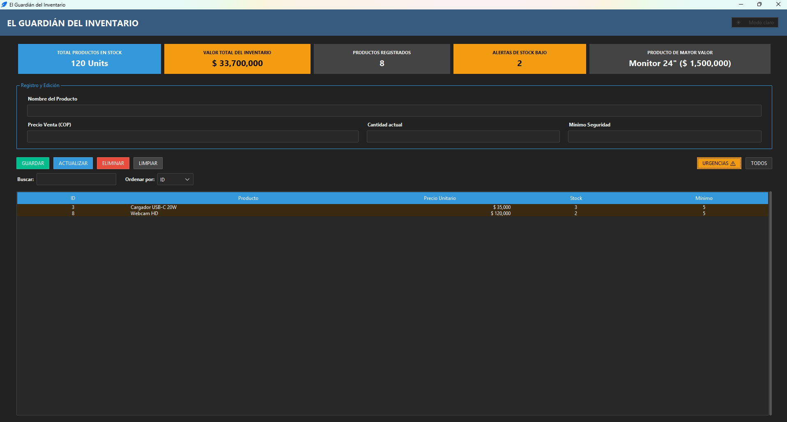
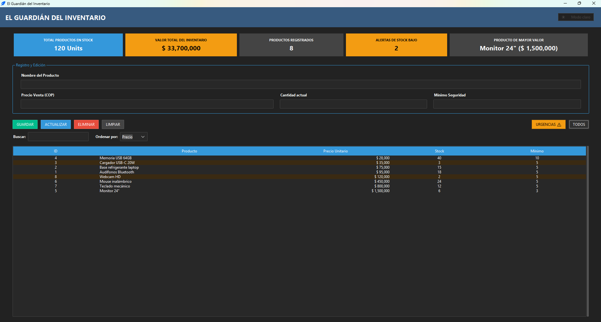

# Inventory Guardian

A desktop inventory management app for small businesses. Tracks stock levels, flags low-inventory products automatically, and shows a real-time financial summary — all running locally, no server required.

---

## 🔄 Features

- Full CRUD for products: name, unit price, current stock, and minimum safety stock
- Live dashboard with 5 metrics: total units in stock, total inventory value (COP), products registered, low-stock alerts, and the highest-value product
- One-click filter for products at or below their minimum stock, highlighted directly in the table
- Search by product name, live as you type
- Sort by ID, Name (Z-A), Price, or Stock
- Dark/light theme toggle, dark by default
- IDs are re-indexed alphabetically after every change, so the product list always reads in order without a separate sort step

---

## 🛠️ Tech stack

- Python 3.8+
- [ttkbootstrap](https://pypi.org/project/ttkbootstrap/) — themed Tkinter widgets, dark/light mode
- SQLite3 (Python's standard library) — local, file-based storage

---

## ⚙️ Setup instructions

1. Clone the repo:

```
git clone https://github.com/jorgegmch/inventory-guardian.git
```

2. Install dependencies:

```bash
pip install -r requirements.txt
```

3. Run it:

```bash
python main.py
```

No configuration or API keys needed — the database file is created automatically on first run.

(Optional) To keep dependencies isolated from your system Python, create and activate a virtual environment before step 2: `python -m venv venv`, then `source venv/bin/activate` (macOS/Linux) or `venv\Scripts\activate` (Windows).

---

## 🧭 Usage

- Fill in the product form and press **GUARDAR** to add a new product.
- Select a row in the table to load it into the form, edit the values, and press **ACTUALIZAR**.
- Press **ELIMINAR** to remove the selected product (with confirmation).
- Press **URGENCIAS** to filter the table to only products at or below their minimum stock; **TODOS** returns to the full list.
- Use the search box to filter by name, or the "Ordenar por" dropdown to change the sort order.
- Toggle dark/light mode from the button in the top-right corner.

---

## 📸 Screenshots

**All products**



**Low-stock alerts**



**Sorted by price**



---

## 📁 Project structure

```
inventory-guardian
├── docs/
│   ├── all-products.png
│   ├── sorted-products.png
│   └── urgent-products.png
├── .gitignore
├── app.py
├── database.py
├── LICENSE
├── main.py
├── README.md
└── requirements.txt
```

---

## License

MIT — see [LICENSE](LICENSE) for details.

Built by [Jorge Gomez](https://github.com/jorgegmch)